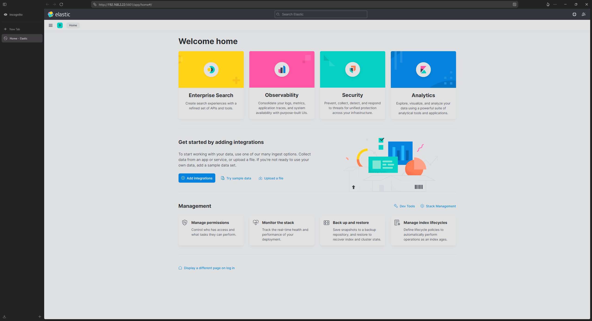
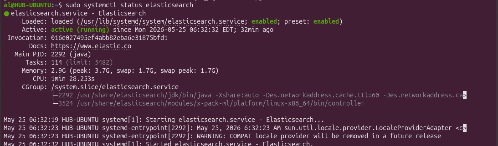
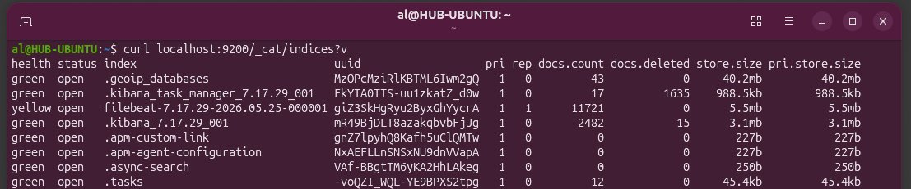
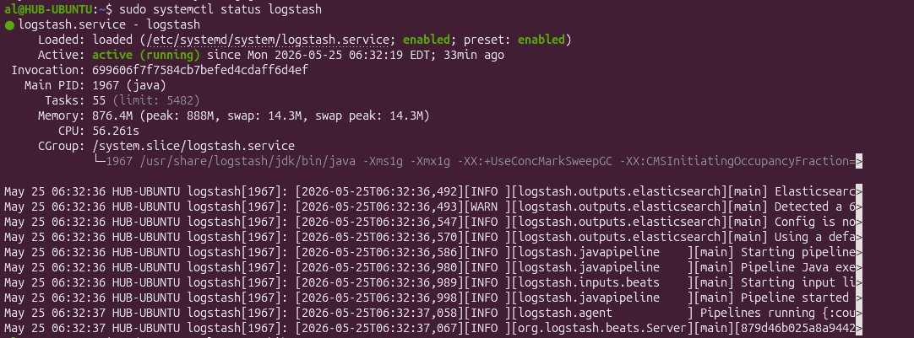
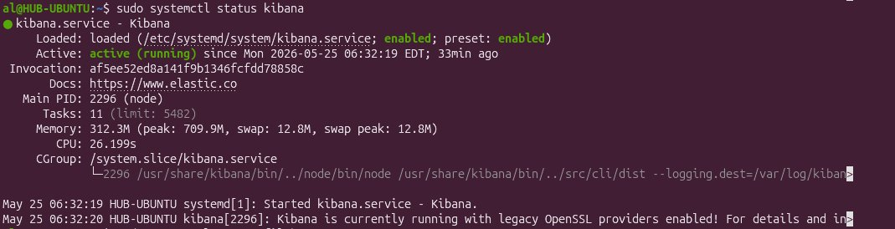
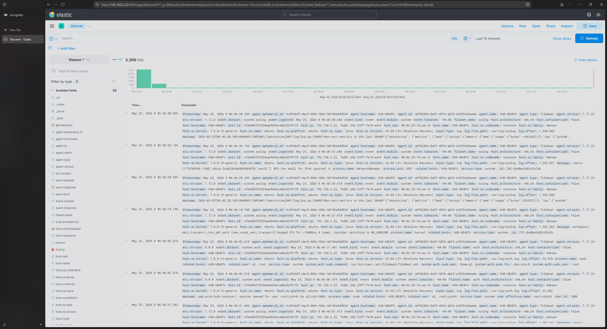
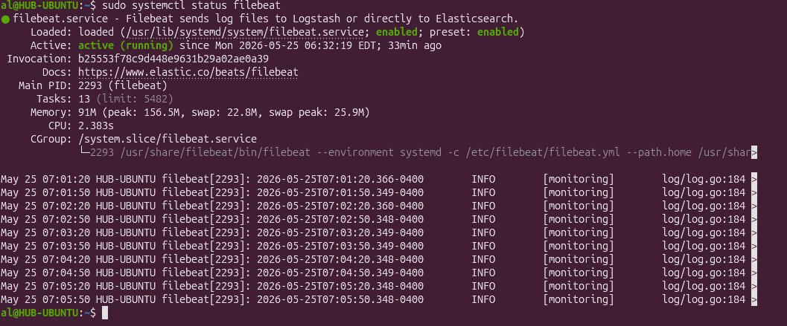
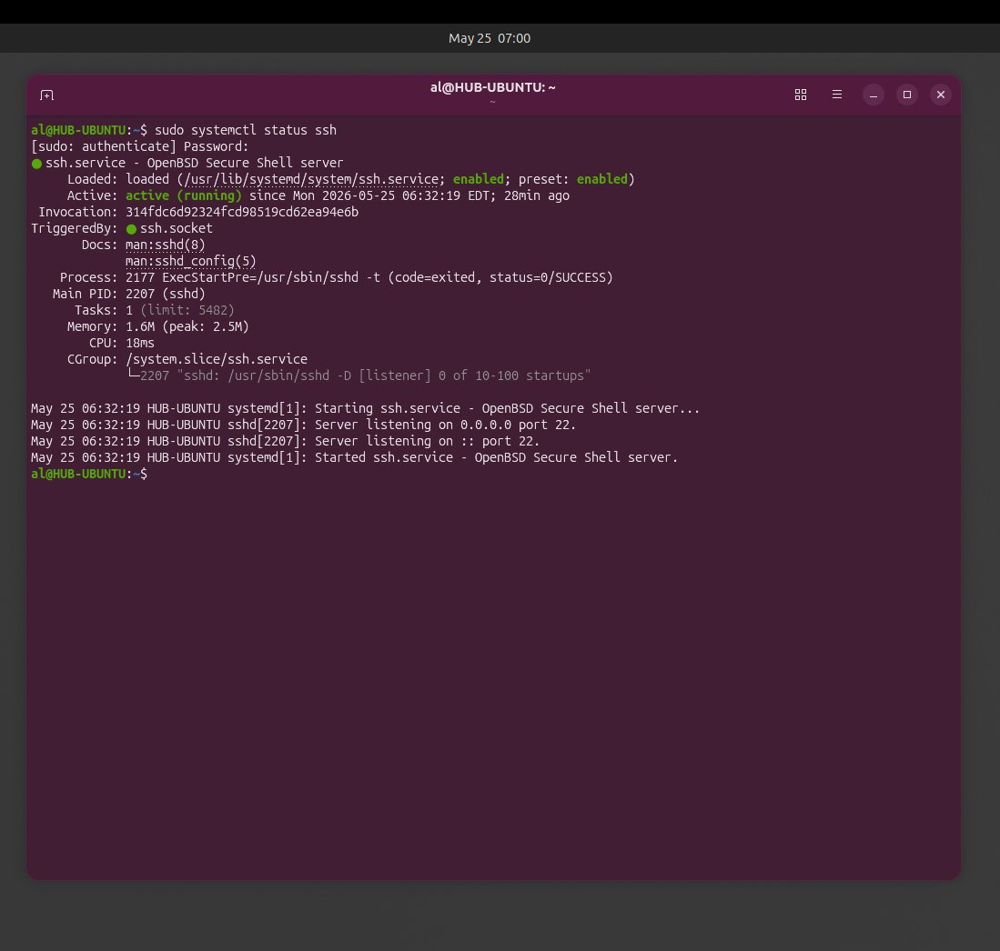

# Screenshots — Elastic SIEM Lab

Visual proof of the full ELK stack running and ingesting logs.

---

## Kibana Welcome Page

> Kibana home page — confirming successful connection to Elasticsearch at port 5601.

---

## Elasticsearch — Running

> `systemctl status elasticsearch` — active (running), enabled on boot. Using 2.9GB RAM, confirming a healthy production-style deployment.

---

## Elasticsearch — Indices Confirmed

> `curl localhost:9200/_cat/indices?v` — confirms Filebeat index exists with 11,721 documents ingested. Pipeline is working end-to-end.

---

## Logstash — Running

> `systemctl status logstash` — active (running). Logs confirm Beats input listener started and pipeline is live.

---

## Kibana — Running

> `systemctl status kibana` — active (running), enabled on boot. Accessible at port 5601.

---

## Log Events

> Kibana Discover showing 3,366 hits — real-time log events flowing from Filebeat through Logstash into Elasticsearch. Index pattern: `filebeat-*`.

---

## Filebeat — Running in VM

> Filebeat status confirmed inside the Ubuntu VM terminal.

---

## SSH — Running

> `systemctl status ssh` — OpenSSH server active, listening on port 22. Remote access to the SIEM box is enabled.
